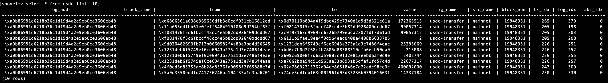

# ETHBerlin-shovel-bootstrap

Helm chart that deploys [shovel](https://indexsupply.com/shovel/) together with postgresql.

From the shovel docs:

> Shovel is an open source tool for synchronizing Ethereum data to your Postgres database.
Own your blockchain data without vendor lock-in.


## Getting Started

The example below uses the default configuration, as shown in the `shovel.config` section within the `values.yaml`:

```bash
# show the config
yq '.shovel.config' chart/shovel/values.yaml
# install the chart and set the load balancer that is available in your cluster.
# We use tailscale to reach our bare metal lab cluster
helm install shovel chart/shovel --set postgresql.primary.service.type=LoadBalancer --set postgresql.primary.service.loadBalancerClass=tailscale
# wait for pods to be ready
kubectl get pods -w
# check the logs of the shovel pod
kubectl logs -f <insert-pod-name>
# get the service IP
kubectl get svc
# connect using psql
PGPASSWORD=shovel psql shovel --host <insert-service-ip> --port 5432 --username shovel -c
# query the database
select * FROM usdc;
```


